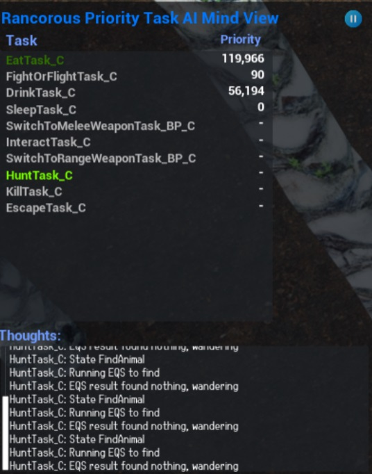

# Rancorous Priority Task AI

## Overview
A high performance AI system based on Tasks with dynamically calculated priority.

## Dependencies

NOTE: This plugin requires The Rancorous Utilities plugin: https://github.com/RancorousGames/RancUtilities
Place it in the Plugins folder next to this plugin. 

## Key Features

+ Dynamic Priority Calculation: Tasks have priorities that are recalculated in real-time, allowing AI characters to adapt their behavior based on current needs and situations.
+ Modular Task Components: Easy integration and customization with modular blueprint components for various AI tasks.
+ State-Machine Integration: Seamless compatibility with state-machine logic, enhancing the responsiveness and versatility of AI characters.
+ Efficient Performance: Optimized for high performance, ensuring smooth operation even in complex game scenarios.
+ Customizable Task Categories: Supports primary and invoked tasks, enabling a wide range of AI behaviors from basic actions to complex strategies.

## Future Features:
+ Field-based AI Simulation: AI characters operate differently based on their proximity to the player, with full simulation for nearby AI and simplified logic for distant ones.

## Documentation

See Miro Board: https://miro.com/app/board/uXjVNOGEHRU=/?share_link_id=992820492998