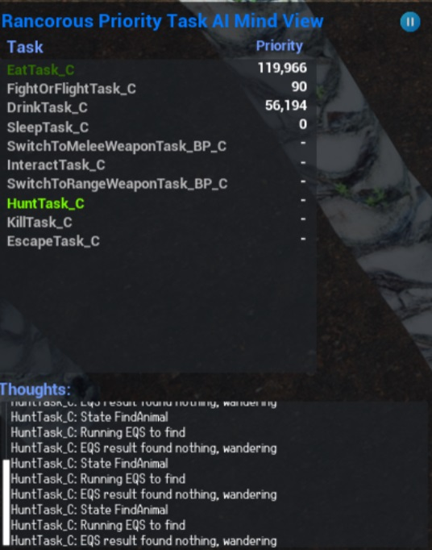

# Rancorous Priority Task AI

## Overview
A high performance AI system based on Tasks with dynamically calculated priority.

## Dependencies

NOTE: This plugin requires The Rancorous Utilities plugin: https://github.com/RancorousGames/RancUtilities
Place it in the Plugins folder next to this plugin. 

## Key Features

+ Dynamic Priority Calculation: Tasks have priorities that are recalculated in real-time, allowing AI characters to adapt their behavior based on current needs and situations.
+ Modular Task Components: Easy integration and customization with modular blueprint components for various AI tasks.
+ State-Machine Integration: Seamless compatibility with state-machine logic, enhancing the responsiveness and versatility of AI characters.
+ Efficient Performance: Optimized for high performance, ensuring smooth operation even in complex game scenarios.
+ Customizable Task Categories: Supports primary and invoked tasks, enabling a wide range of AI behaviors from basic actions to complex strategies.

## Version 1.4.0

Tasks run on the authoritative controller. The plugin does not replicate cognition or task state. Drive `URAIManagerComponent::UpdateActiveTasks()` from your game tick or scheduler; the manager has no mandatory timer of its own.

`Initialize(Controller, Pawn)` registers the controller's task components and supports any pawn. `ARAIController::OnUnPossess()` calls `Deinitialize()`, which interrupts the chain, cancels task-owned callbacks and releases possession references. `SetRAIActive(false)` interrupts ongoing work; enabling resumes arbitration.

Tasks have explicit Inactive, Running, Waiting and Ending states. Returning from BeginTask while Running does not restart the task. The deprecated `bLegacyReinvokeIfNotWaiting` opt-in defaults to false. Invocation rejects active targets, cycles and chains deeper than `MaxInvokeDepth` (default 6). The existing bool InvokeTask remains; InvokeTaskWithResult distinguishes Started, CompletedImmediately and Rejected. Synchronous completion is delivered after the invocation call returns.

EndTask keeps its Blueprint signature. EndTaskWithReason adds an outcome tag; the parent receives OnInvokedTaskCompletedWithReason, whose default forwards to the original completion event. Descendants end first as interrupted. A wait timeout fails its subtree and returns failure to its surviving parent. EndInvokedChild cancels a method without rewriting chain links.

Use SetTaskEnabled for runtime primary-task changes. TaskThreshold defaults to zero; scores must exceed it, and a root with InterruptIfReachesZero ends at or below it. An invoked primary winner can take over as root when the interrupt policy permits it. GetPriority returns the task's own score; GetEffectivePriority returns its chain root's score. NextBeginCooldown starts at task end, while configured Cooldown defaults to begin-to-begin timing. Loop penalties expire without changing configured properties; `rai.LoopPenalty 0` disables the penalty but retains detection events.

FRAITaskInvokeArguments supports an FInstancedStruct Payload and GetPayload<T>() alongside the legacy fields. URAIInterruptPolicy can override interruption. RequestReevaluation emits a scheduling signal; manager begin/end/arbitration/rejection/loop events and a bounded typed trace ring expose decisions. DescribePriority can supply named terms in development builds when bCaptureExplanations is enabled. Legacy string thoughts are off by default.

Inject IRAITimeSource and IRAIScheduler with SetServices before possession or memory BeginPlay. Scheduling must be asynchronous, owner-aware and cancellable. The defaults use world time and FTimerManager. Changing manager services deinitializes it; reinitialize before updates. Memory pause/resume preserves the remaining maintenance delay, and EndPlay cancels maintenance.

Mind and Memory may live alongside each other on a pawn, controller or other actor. WorkingSetCap and LongTermCap independently bound memory. LearnFact defaults to storing new payload/provenance and blending confidence by FactConfidenceBlend (0.3); Replace and KeepHigherConfidence policies are available. RecallRefs/RecallAboutRefs return ranked indices using partial sorting; indices are invalidated by storage mutation. Blueprint copying APIs remain. Time stamps and decay use double simulation time. The old Knowledge component is retained with a deprecation warning, weak actor keys and local authority-only legacy wrappers; it no longer declares RPCs.

Blueprint runtime status is read-only. Public C++ status aliases remain for 1.4 compatibility; prefer the task/manager accessors and managed lifecycle APIs. Full encapsulation is deferred to 2.0. Task sets, GOAP, coroutine helpers, field LOD and smooth-path extraction are outside this release.

The descriptor permits Win64, Linux and LinuxArm64. Linux compilation is **not verified** locally; the Linux toolchain and compatible RancUtilities platform allow-list are prerequisites. GameplayTagsEditor is enabled only for editor targets. On UE 5.8, FInstancedStruct comes from CoreUObject; no StructUtils module is required.

## Verification

The plugin registers 40 EditorContext automation tests under `RancPriorityTaskAI`, covering chain safety, actual wait timers, teardown, scheduling, policies, payloads, traces, memory and a 16-task microbenchmark. Build and launch matching editor configurations; EditorContext tests do not run under `-game`. The Wartribes integration gate also runs its four AI handover/cognition tests and the real 64-check M1 HUD scenario. A rendered scenario is separate from manual visual inspection.

## Documentation

See the public headers and [refactor status/proposal](REFACTOR_PROPOSAL.md). Historical proposal snippets are design examples; the status table identifies implemented and deferred work.

## Packaging

To make the plugin usable in blueprint only projects we need to package it.
This is done through the Plugins settings in the engine with a C++ project that has the plugin installed.
Because this plugin has a dependency on Rancorous Utilities plugin you need to have that plugin a place where the packaging tool can find it.
The only way to do that is to place the *packaged* Rancorous Utilities plugin inside \Engine\Plugins\Marketplace.
